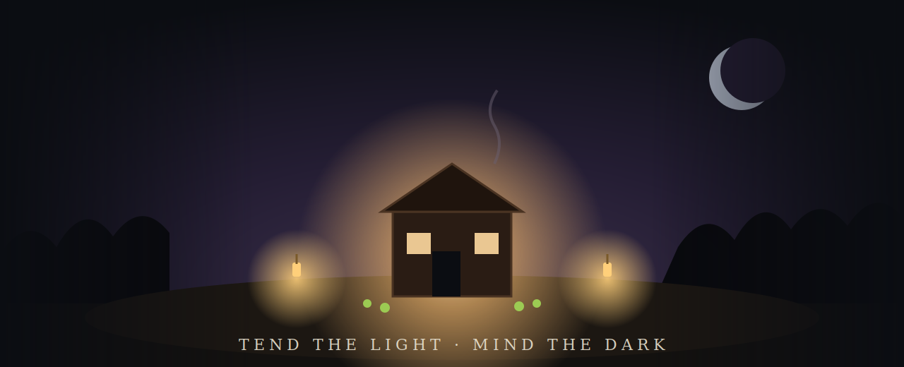

<!-- key art -->

<h1 align="center">HEARTHSHADE</h1>

<b>Tend the light. Mind the dark.</b> 
A dark-cozy life-sim where the chores that keep you safe are the chores that keep you sane.

---

> **Studio niche pick #1 for 2026-2027 - Dark-Cozy (cozy-horror).**
> Chosen via the studio's research -> critic-cycle -> design pipeline. Full sourcing in
> [`docs/MARKET_VALIDATION.md`](docs/MARKET_VALIDATION.md).

## Why this game

Cozy is the clearest five-year growth trend on Steam, yet self-described cozy is still only ~3.1% of
games grossing >$100k LTD - and **cozy-horror specifically is being called "the next big trend"** with proof
points (Grimshire = "Overwhelmingly Positive") but **no content-rich flagship**. Hearthshade is built to be
that flagship: Stardew-deep daytime warmth fused with a dread you **manage, not fight**.

**The hook:** lanterns, fire, food and friendship are cozy by day and your *only* defenses at night. Your
decorations literally are your survival kit, so the relaxing "build the perfect cottage" fantasy and the tense
"keep the light alive" fantasy are the **same** progression curve. No combat. No twitch skill.

## What's in this repo

| Path | What |
|---|---|
| [`GDD.md`](GDD.md) | Full Game Design Document |
| [`docs/MARKET_VALIDATION.md`](docs/MARKET_VALIDATION.md) | Sources, traction signals, and the 10->2 critic-cycle log |
| [`prototype/index.html`](prototype/index.html) | **Self-contained** HTML5 Canvas prototype of the day->dusk->night->dawn loop (open in any browser - zero dependencies) |
| [`unity/`](unity/) | Unity **6000.4.4f1** project: folder layout, core C# systems, scene manifest, prefab specs, onboarding README |
| [`branding/`](branding/) | Logo + key-art (SVG) |

## Run the prototype

Open `prototype/index.html` in any modern browser. Press **Start day**, then:
`WASD`/arrows move - `E` interact (plant/harvest/refuel/buy) - `Q` place a lantern - `Space` rest at the hearth.
Survive each night by keeping the homestead lit; the Gloam withers crops and erodes your nerve (Resolve).

## Open the Unity project

Unity Hub -> Add -> `unity/` -> open with **6000.4.4f1**. See [`unity/README.md`](unity/README.md) for setup and
[`unity/ProjectStructure.md`](unity/ProjectStructure.md) for the scene manifest and prefab specs.

## Status

Concept + vertical-slice scaffold. Next: author `Homestead.unity`, wire URP 2D lights to the Gloam grid, and
ship the first Autumn as a free Steam **Prologue** to build wishlists ahead of Next Fest.

---
Built by the Abdulmalek Agents virtual game studio. Market figures are directional, from public 2024-2026 sources; re-pull at green-light.
